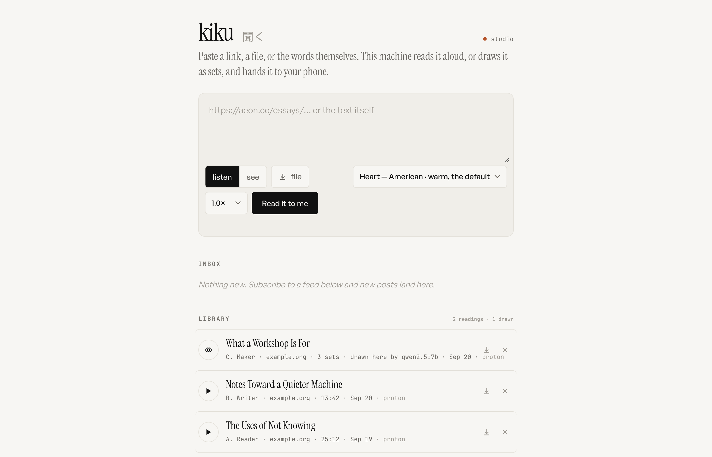

# kiku · 聞く

Paste a link, a file, or the words themselves. Your Mac reads it aloud with Kokoro and hands the audio to your phone as a private podcast episode — or, if you ask to _see_ it instead, a local model reads it into three or five overlapping sets and draws them as one interactive page you can open anywhere. Either lands in your Proton Drive. Nothing leaves the machine: no API keys, no cloud voices, no cloud models, no font requests, no analytics. It runs at home and on a laptop with no network.



## What it reads and writes

It reads the links you paste, the files you drop, the text you type and the feeds you subscribe to, all from the Mac it runs on. It writes to one folder, `~/Kiku/` (`KIKU_HOME` moves it):

| Path                              | What                                                        |
| --------------------------------- | ----------------------------------------------------------- |
| `audio/*.mp3`, `text/*.txt`       | each reading, and the cleaned paragraphs it was read from   |
| `artifacts/*.html`                | each drawing: one self-contained page, fonts inside         |
| `library.json`, `positions.json`  | the library, and where you stopped in each reading          |
| `jobs.json`                       | jobs, so one interrupted by a restart is reported, not lost |
| `podcasts.json`, `textfeeds.json` | subscriptions of both kinds, and the Inbox                  |
| `public-token`                    | the secret behind the optional public feed link             |

Outside that folder: `~/Library/Logs/kiku.log` when it runs under launchd; the Kokoro weights, about 340 MB, in `~/.cache/huggingface/hub/`, downloaded once on the first reading; and, if the Proton Drive app is signed in, a copy of every reading and drawing in `<Proton Drive>/Kiku/Audio/` and `Kiku/Artifacts/` (`KIKU_EXPORT_DIR` chooses another folder; no folder means no copies, and nothing else changes).

Everything else stays on the machine. The only outbound requests are the links and feeds you gave it and that one model download: no cloud voices, no cloud models, no API keys, no analytics, no fonts from a CDN. Drawing talks to Ollama on `127.0.0.1` and to nothing else. The page and the feed are served to your home network with no login, so your Wi-Fi is the trust boundary. [SECURITY.md](SECURITY.md) has the whole model, including what the public feed link exposes if you turn it on.

## Prerequisites

- **An Apple silicon Mac.** The speech step is Kokoro-82M through `mlx-audio`, which is MLX, which runs only on Apple silicon. On any other machine the pipeline extracts and cleans and then has nothing to speak with. Making the speech step pluggable is [spec 002](docs/features/002-pluggable-speech.md), still a draft.
- **Node 25** (`.nvmrc`) and **pnpm 10** (`packageManager` in `package.json`).
- **uv**, which builds the Python 3.12 environment from `pyproject.toml`.
- **ffmpeg** for encoding, **pdftotext** from poppler for PDFs, **markitdown** for EPUB and as the PDF fallback (`uv tool install "markitdown[all]"` puts it on the PATH), and macOS **textutil** for Word, RTF and ODT.
- **Ollama** with one model, only for drawing. kiku picks the largest installed model that fits in three quarters of memory (`KIKU_MODEL` pins one); on a 16 GB laptop that is `qwen2.5:7b`. Listening works without it.

`bin/doctor` checks all of this and prints the exact command for anything missing. The page shows the same line when something is.

## Run

```bash
git clone https://github.com/pvcomms/kiku && cd kiku
bin/setup-road               # everything above, idempotent; ends in bin/doctor
pnpm start                   # or pnpm dev, which restarts when a file changes
```

`bin/setup-road` installs the Homebrew formulae, `pnpm install`, builds `.venv`, starts Ollama under launchd and pulls the model, downloads the Kokoro weights with a first reading, installs the kiku agent and builds the Mac app. Run it again any time; it only does what is not done. The pieces on their own:

```bash
pnpm install
bin/setup-python.sh          # .venv from pyproject.toml; Apple silicon only
node bin/vendor-venn.mjs     # only if you change the venn template; assets/venn.html is committed
```

Open `http://<your-mac>.local:4747`. The server prints its own addresses when it starts, and the page shows them under the feed address. Follow `http://<your-mac>.local:4747/feed.xml` in any podcast player on the network. The first reading downloads the Kokoro weights; after that the speech step is offline.

To keep it running across logins and crashes, install it as a launchd agent:

```bash
bin/install-launchd                                    # renders launchd/com.param.kiku.plist.template for this machine and loads it
bin/install-launchd --print                            # show what would be installed, install nothing
launchctl kickstart -k gui/$(id -u)/com.param.kiku    # restart
tail -f ~/Library/Logs/kiku.log                        # watch
```

Run it by hand (`pnpm start`) only with the agent stopped; two instances cannot share a port. `KIKU_HOME` and `KIKU_PORT` run a second instance beside the first.

The Python side lives in `.venv` at the repo root, because `src/tts.ts` spawns `.venv/bin/python bin/tts.py` from there. `pyproject.toml` pins what goes in it (`mlx-audio`, `misaki[en]`, `soundfile`, `numpy`, the `en_core_web_sm` spaCy pipeline) and `bin/setup-python.sh` builds it; rebuild it rather than editing it. The Kokoro weights cache in `~/.cache/huggingface/hub/models--mlx-community--Kokoro-82M-bf16`.

## Use it

**Listen or see.** The form has one choice. _Listen_ reads it aloud. _See_ hands it to a local model and draws it as three (or five) overlapping sets — what the document is made of, what exists only where two of its sets meet, what sits in the middle, where the author stands, and the set it circles but never draws — as one interactive page in `~/Kiku/artifacts/` that opens from anywhere, offline, with the diagram's own customise panel still live underneath. The model never leaves `127.0.0.1`.

**Phone.** Share a link from Brave to the **Kiku** shortcut. Or open the page in Brave, paste, press _Read it to me_ (or _Draw it for me_). New readings show up in Apple Podcasts once you follow the feed: Podcasts → Library → ⋯ → _Follow a Show by URL_ → paste the feed address. The page itself is a player too: background audio, lock-screen controls, and your position is kept on the server so the phone, the iPad and the Mac resume the same spot (Brave → Share → Add to Home Screen gives it an icon). (Verified on the Mac Podcasts app: the plain-http `.local` feed is accepted and both episodes appear.)

**Mac.** `/Applications/Kiku.app` opens the page in its own window and starts the service if it is asleep. Or the terminal:

```bash
kiku https://aeon.co/essays/…          # a page
kiku ~/Downloads/chapter.epub          # md, txt, html, pdf, epub, docx, rtf
kiku "Some text to hear"               # pasted text
kiku --see https://aeon.co/essays/…    # draw it as three sets instead; --see5 for five
kiku                                   # library + feed address
kiku --open                            # the page
bin/doctor                             # what this machine has, and the fix for what it lacks
```

Long books (over ~9,000 words with chapter headings) become one episode per chapter. A drawing of a long document is made from its outline, opening and close, and says so.

## How it works

```
link ──▶ fetch + defuddle ─┐
file ──▶ markitdown/pdftotext ─┼─▶ extract.ts ──┬─ listen ─▶ clean.ts ──▶ bin/tts.py  Kokoro-82M via mlx-audio
text ──────────────────────┘                    │                               │  ~19× realtime on the M3 Ultra
                                                │                               ▼
                                                │                   ffmpeg → mp3 (96k mono, ID3 tags, cover art)
                                                │
                                                └─ see ─▶ analyze.ts ──▶ Ollama on 127.0.0.1 ──▶ artifact.ts ──▶ one .html
                                                             (validate, repair once)          (the venn template + its config)
                                                                                │
                            ~/Kiku/library.json ◀───────────────────────────────┘
                                   ├──▶ /feed.xml (RSS + iTunes tags, Range-capable audio; audio only)
                                   ├──▶ the page: player, /artifacts/:file
                                   └──▶ <Proton Drive>/Kiku/{Audio,Artifacts}/   (a copy, after the fact; never read back)
```

- `src/server.ts` — Hono on Node 25 (type-stripped TypeScript, no build step). Routes: `/`, `/health`, `/api/jobs`, `/api/library`, `/feed.xml`, `/audio/:file`, `/artifacts/:file`, `/api/export/reconcile`, `/cover.png`.
- `src/extract.ts` — URL / file / text → `{ title, author, site, markdown }`; chapter splitting for books.
- `src/clean.ts` — markdown to prose Kokoro reads well (links to their text, no code, no footnote markers, abbreviations expanded).
- `src/tts.ts` + `bin/tts.py` — spawns the MLX driver, streams progress, encodes.
- `src/analyze.ts` — asks the model for the smallest thing that can become a diagram: labels, one-line descriptions and the names of the meetings, by index. Colours, ids and physics are the template's own. One repair with the problems named; then failure with them listed.
- `src/artifact.ts` — writes the config into `assets/venn.html`, a copy of [interactive-venn-template](https://github.com/pvcomms/interactive-venn-template) with its Google Fonts replaced by inline `@font-face`, made by `bin/vendor-venn.mjs`.
- `src/export.ts` — the Proton Drive copies. `src/preflight.ts` — the readiness report behind `/health` and `bin/doctor`.
- `src/ui.ts` — the page. Instrument Serif / General Sans / JetBrains Mono, self-hosted in `assets/fonts`.

## Feeds & Inbox

Subscribe to a blog, newsletter, or news feed (paste its RSS/Atom URL under **Feeds**) and Kiku checks it every 30 minutes. New posts wait in the **Inbox** — tap one to read it aloud through the same pipeline as a pasted link, or dismiss it. Subscribing starts a feed caught-up: only posts published after you add it show up, so you never get its whole archive dumped in at once.

- `src/textfeeds.ts` — `TextFeeds` (subscriptions + inbox, `~/Kiku/textfeeds.json`) and a hand-rolled RSS 2.0 / Atom parser (`parseArticleFeed`).
- Routes: `GET/POST /api/feeds`, `DELETE /api/feeds/:id`, `POST /api/feeds/import` (bulk, e.g. from an OPML/RSS Guard export), `POST /api/feeds/poll` (check now), `GET /api/inbox`, `POST /api/inbox/:id/listen`, `POST /api/inbox/:id/dismiss`.
- This is for text feeds only — real podcasts (audio enclosures) stay in the **Podcasts** section above and play directly from the publisher's file.

## The Mac app

`app/main.swift` is a 150-line WebKit window onto the page: native file picker, confirm dialogs, mp3 downloads handed to the browser, and a self-heal that kicks the launchd agent if the server is not answering. Rebuild and reinstall with `app/build.sh` (needs the Xcode Command Line Tools; ad-hoc signed, so it only runs on this Mac).

## Voices

Kokoro grades its own voices; the page offers the good ones: Heart (default), Bella, Emma (British), Michael, George (British). Speed is best left at 1.0 and changed in the podcast app.

## Away from home

Everything binds to the home network. To use it anywhere, log into Tailscale on the Mac (menu bar app) and on the phone (App Store app), then:

```bash
kiku-remote
```

That runs `tailscale serve` and prints an `https://<mac>.<your-tailnet>.ts.net/` address with a real certificate. Follow that feed in Podcasts instead of the `.local` one and it works on cellular. Nothing is exposed to the public internet; only devices on your tailnet can reach it. (A truly public URL is possible with `tailscale funnel`, but then anyone with the link can queue readings on your Mac, so it would need a password first.)

## On the road

The tailnet reaches a Mac at home. To take kiku itself — on a laptop, on a plane, with no network — install it there:

```bash
git clone https://github.com/pvcomms/kiku && cd kiku && bin/setup-road
```

Once the Kokoro weights and the model are on disk nothing else is fetched: `HF_HUB_OFFLINE` is set for you, and both the voice and the model run on the laptop. `bin/doctor` is what to run when something is off; every red line ends in the command that fixes it. Readings and drawings land in `~/Kiku/` first and are copied to Proton Drive when its app is signed in, so two machines can each keep their own library and still meet in one folder.

To carry a spare, `bin/mirror-ssd` copies the library, the weights, the one model, the Python runtime and this repo to `/Volumes/Go/kiku-road` (`KIKU_SSD` for another volume), deleting nothing there; `bin/restore-from-ssd` brings a wiped or borrowed Mac up from it without the network. kiku never looks for the SSD — it is a copy, not a dependency.

The speech and analysis steps run strictly one after the other, and the model is released as soon as it answers, so a 16 GB laptop is enough.

## Which player

- **Kiku's own page** — free, yours, no account: open the tailnet address on any device, press play. Positions sync through the server.
- **RSS Guard** — FOSS desktop reader with a built-in enclosure player; add `http://<your-mac>.local:4747/feed.xml` at home, or the `https://<mac>.<your-tailnet>.ts.net/feed.xml` address from `kiku-remote` anywhere.
- **Apple Podcasts** — not open source, but it fetches from the device, so the private feed stays private; syncs iPhone↔iPad.
- **Pocket Casts** — the apps are open source (MPL-2.0) but the service crawls feeds from its cloud, so it needs the public secret link from `kiku-public`, and Automattic sees the titles.

## Shortcut (build once on the phone, two actions)

Shortcuts can't be signed on this Mac (no iCloud), so make it by hand. Shortcuts app → + → name it **Kiku**, turn on _Show in Share Sheet_, then add:

1. **URL Encode** — input: _Shortcut Input_.
2. **Open URLs** — `http://<your-mac>.local:4747/?u=` followed by the _URL Encoded Text_ variable.

Sharing a page from Brave now opens Kiku with the link already submitted. Once you are on Tailscale, swap the host for the `ts.net` one so it works away from home too. The quieter variant (no browser tab) is three actions: _Get URLs from Input_ → _Get Contents of URL_ (POST, JSON body `{ "url": URLs, "text": Shortcut Input }` to `/api/jobs`) → _Show Notification_. `shortcut/Kiku.plist` is that variant as a plist, for reference.

## Part of the constellation

kiku is one instrument of the [Center for Applied Post-Phenomenology](https://postphenom.com): tools built for one life and published so that anyone can run their own, sharing one rule, that the tool surfaces and the person judges. Its siblings are [niwa](https://github.com/pvcomms/niwa), the garden where memory, vocabulary and code are one graph, [interactive-venn-template](https://github.com/pvcomms/interactive-venn-template), terra-cognita and chronology; the last two are not yet published. The rules they all share are the block at the end of `AGENTS.md`.

## License

MIT. See [LICENSE](LICENSE).
